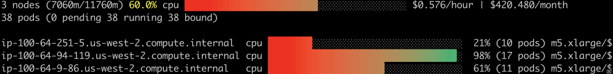

## Custom Scheduler for Amazon EKS with Binpackingd

When running jobs on Kubernetes, the default kube-scheduler will balance the pods across the nodes which resuilt in fragmentations causing cost increase. Job workloads like Spark, is not long running, and many customers have different sizes of jobs. Without bin packing for kube-scheduler, node usage can not be increased and node can be scale in in time.

In this repo, we provide an example of how to run custom scheduler with Amazon EKS 1.24+.


## Installation

### Prequisites

* Amazon EKS 1.24+
* kubectl

### Install eks-node-viewer

eks-node-viewer is a tool for visualizing dynamic node usage within a cluster, we will use this for tracking the binpacking.

**HomeBrew**

```shell
brew tap aws/tap
brew install eks-node-viewer
```

**Manual**

```shell
go install github.com/awslabs/eks-node-viewer/cmd/eks-node-viewer@latest
```

**eks-node-viewer output example**




**eks-node-viewer**：https://github.com/awslabs/eks-node-viewer

### Install eks-node-viewer

The difference between Amazon EKS 1.24 and Amazon EKS 1.29 are image version and apiversion.
We do not recommend build the kube-scheduler by yourself, we can leverage the eks-distro kube-scheduler image.

Amazon EKS 1.29 Image: public.ecr.aws/eks-distro/kubernetes/kube-scheduler:v1.29.6-eks-1-29-18
Amazon EKS 1.24 Image: public.ecr.aws/eks-distro/kubernetes/kube-scheduler:v1.24.16-eks-1-24-25

The KubeSchedulerConfiguration API version is stable(v1) in Kubernetes 1.25, for those cluster prior to 1.25, should use kubescheduler.config.k8s.io/v1beta2.

#### Manifests

**Amazon EKS 1.24**

```shell
kubectl apply -f deploy/manifests/custom-scheduler/amazon-eks-1.24-custom-scheduler.yaml
```

**Amazon EKS 1.29**

```shell
kubectl apply -f deploy/manifests/custom-scheduler/amazon-eks-1.29-custom-scheduler.yaml
```

**Other Amazon EKS versions**

* replace the related image URL(https://gallery.ecr.aws/eks-distro/kubernetes/kube-scheduler)
* For none Amazon EKS 1.24, use Amazon EKS 1.29 manifests and related image

#### Helm

Comming soon


## Testing

### Launch eks-node-viewer

```shell
eks-node-viewer --extra-labels topology.kubernetes.io/zone
```

### EKS node usage before the deployments


### Apply a new deployment

```shell
kubectl apply -f deploy/deployments/nginx-deployment.yaml
```

### EKS node usage after the deployments


## Security

See [CONTRIBUTING](CONTRIBUTING.md#security-issue-notifications) for more information.

## License

This library is licensed under the MIT-0 License. See the LICENSE file.